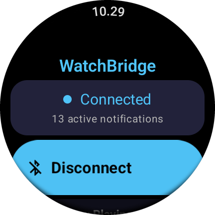
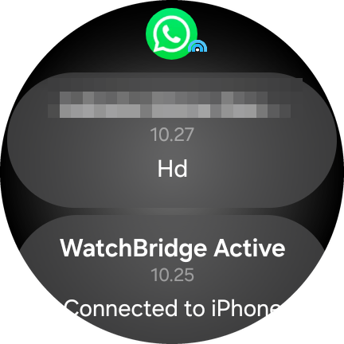
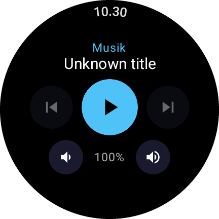
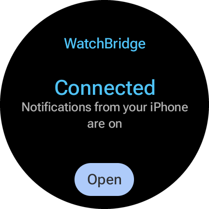
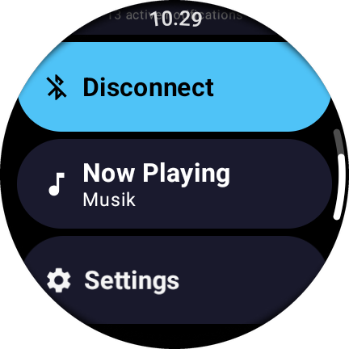
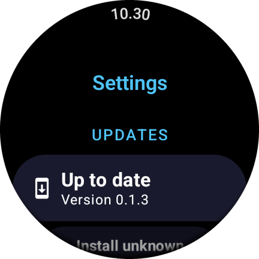
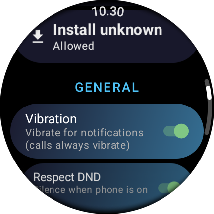
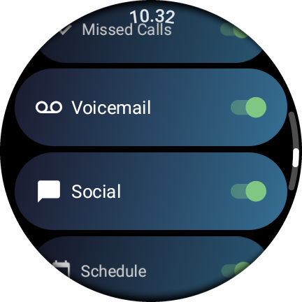

# WatchBridge

### Connect your Wear OS Galaxy Watch to an iPhone — no companion app needed.

Your iPhone's notifications, calls and music controls, right on your Galaxy Watch. Free and open source.

[](https://github.com/Irwanripansyahh/watchbridge/releases/latest)
[](LICENSE)

> **Forked from [rajtiwariee/watchbridge](https://github.com/rajtiwariee/watchbridge).** Thanks to the original author for the BLE/ANCS foundation.
> This fork adds: native Wear OS notifications with each app's real icon and original time, per-app stacks and chat conversations, iPhone media controls (AMS), a camera remote for the iPhone, a connection tile, never-give-up reconnect plus auto-start after reboot, in-app updates from GitHub Releases, more reliable notification loading when many arrive at once, and a working vibration toggle.

WatchBridge is a single Wear OS app that runs on your **Galaxy Watch 4 or newer (Wear OS 3+)** and connects to an iPhone over BLE to receive notifications and call alerts, and to control the iPhone's music, using Apple's ANCS (Apple Notification Center Service) and AMS (Apple Media Service) protocols.

### No companion app on the iPhone

There is **nothing to install on the iPhone** — no App Store app, no TestFlight, no jailbreak, and no iPhone app running in the background that iOS could close. You only pair the watch once in the iPhone's **Settings → Bluetooth**, like a pair of headphones.

This works because notifications (ANCS) and media controls (AMS) are services **built into iOS** itself: iOS offers them to any Bluetooth device it's paired with. The camera remote works like any Bluetooth selfie stick. WatchBridge on the watch is the only app involved.

---

## Screenshots

*Galaxy Watch (SM-L300), One UI 8 Watch / Wear OS 6*

<table>
  <tr>
    <td align="center"><br><sub>Home</sub></td>
    <td align="center"><br><sub>Notification with the app's real icon</sub></td>
    <td align="center"><br><sub>iPhone media controls</sub></td>
    <td align="center"><br><sub>Connection tile</sub></td>
  </tr>
  <tr>
    <td align="center"><br><sub>Home menu</sub></td>
    <td align="center"><br><sub>Updates in Settings</sub></td>
    <td align="center"><br><sub>General settings</sub></td>
    <td align="center"><br><sub>Category filters</sub></td>
  </tr>
</table>

---

## Features

| Feature | What you get |
|---|---|
| **No iPhone app** | Nothing to install on the iPhone — just pair the watch in Bluetooth settings |
| **Notifications** | Every app that posts to the iOS Notification Center, shown as native Wear OS notifications with the app's **real icon** and the **original time** |
| **Stacked per app** | Ten WhatsApp messages become one WhatsApp stack, not ten loose cards |
| **Chat conversations** | Messages from the same chat are shown together in the native Wear OS chat layout |
| **Two-way dismissal** | Dismissing on the watch clears it on the iPhone, and vice versa |
| **Calls** | Full-screen incoming call with Accept / Decline; ongoing call screen with timer and hang-up |
| **iPhone media controls** | Play/pause, next/previous and volume for Spotify, Apple Music, YouTube Music, podcasts... Turn the bezel/crown for volume. Has its own **Music Control** app icon and tile |
| **Camera Remote** | Shutter button for the iPhone Camera app with an Instant / 3 s / 5 s self-timer. Has its own **Camera Remote** app icon |
| **Tiles** | *Phone connection* (iPhone name, battery, status + one-tap reconnect) and *Music Control* (track, play controls and volume) |
| **Stays connected** | Reconnects by itself when the iPhone is back in range, and after a watch reboot or app update |
| **Filters** | Per-category toggles, Do Not Disturb, silent and pre-existing notifications, vibration on/off |
| **Updates on the watch** | Check, download and install new releases from Settings — no computer needed after the first install |

*Due to iOS limitations, replying to messages, starting calls, and syncing health data are not possible.*

---

## Using WatchBridge

### Notifications

iPhone notifications arrive as regular Wear OS notifications, so they look and behave like any other watch notification: they pop up, vibrate, and sit in the notification list.

- **App icon and name:** each notification shows the iPhone app's real icon (e.g. the green WhatsApp logo) and its name. Icons for ~75 popular apps (WhatsApp, WhatsApp Business, Messages, YouTube, Instagram, Telegram, Gmail, Gojek, Grab, Shopee, Tokopedia, BCA, Livin', BRImo, DANA, OVO, ...) are built into the app and work offline. For any other app the icon is downloaded from the App Store the first time it sends a notification (needs Wi-Fi or LTE on the watch once), then cached.
- **Original time:** a notification shows when it arrived on the iPhone, not when the watch received it — handy for older notifications that sync when the watch reconnects.
- **Stacked per app:** notifications from the same app are grouped. Swipe a whole stack away to clear all of that app's notifications on the iPhone.
- **Chats as conversations:** for messaging apps (iOS "Social" category), all messages from one chat share a single card in the Wear OS chat layout, showing who sent what. Group chats are titled with the group name. Swiping the conversation away clears all of its messages on the iPhone.
- **Action buttons:** when iOS offers actions for a notification (e.g. *Clear*, *Accept*, *Decline*), they appear as buttons under it.
- **Dismissal sync:** dismissing on the watch dismisses on the iPhone; when you read or clear a notification on the iPhone, it disappears from the watch.
- **Stays until you clear it:** notifications are only removed when you clear them, on the watch or the iPhone. They stay when the iPhone goes out of range or WatchBridge restarts (e.g. after an update). Only call screens close when the connection drops.
- **Bursts of notifications:** when many arrive at once (a busy group chat, or everything that piled up while the watch was away), each one still loads its full content. A notification only appears once its content is in — usually well under a second — so there are no half-loaded placeholders. If the iPhone doesn't answer, the watch asks again; if it still can't get the content, the notification says *Open your phone to read it*.

### Calls

- **Incoming call:** a full-screen call screen with the caller's name and **Accept** / **Decline** buttons. The call itself still happens on the iPhone (or its headset) — the watch has no audio link to the iPhone.
- **Ongoing call:** a screen with a call timer and a **Hang Up** button. Hang-up is best-effort, as it relies on undocumented iOS behaviour.
- **Missed calls and voicemail** arrive as normal notifications.
- Calls always vibrate, even when the Vibration setting is off.

### iPhone media controls

Three ways in, all from the same WatchBridge install:

- **Music Control** app icon: WatchBridge adds a second icon to the watch's app list that opens straight into the player.
- **Music Control** tile: the current track with previous / play-pause / next buttons, right next to your watch face. Tap the track name for the full player.
- **Now Playing** on the WatchBridge home screen.

The full player:

- Shows the playing app, song title and artist, with a ring around the screen for the song's progress.
- **Previous / Play-Pause / Next** buttons, and **volume** buttons with the current level.
- **Turn the bezel (Galaxy Watch) or crown** to change the iPhone's volume.
- Works with any app that appears in the iPhone's Lock Screen media controls: Spotify, Apple Music, YouTube Music, YouTube, Podcasts, and so on. Buttons the playing app doesn't support are greyed out.

This uses Apple Media Service (AMS), which, like ANCS, is built into iOS — no iPhone app needed.

### Camera remote

Take photos on the iPhone from your wrist — handy for group shots and selfies with the iPhone propped up.

1. Open the **Camera** app on the iPhone.
2. On the watch, open **Camera Remote** from the app list.
3. Tap the big shutter button.

- **Self-timer:** the chip under the shutter cycles **Instant → Timer 3s → Timer 5s**, and WatchBridge remembers your choice. The countdown shows on the button with a light buzz each second; tap the button again to cancel.
- Works like a Bluetooth selfie stick: the watch presses the iPhone's **Volume Up**, which the Camera app uses as its shutter. In Video mode it starts and stops recording.
- The watch only acts as a remote while the Camera Remote screen is open, and keeps its screen on meanwhile.
- It's an experimental feature: it needs the watch's Bluetooth to support acting as an input device (Galaxy Watch7 does). If not, the screen says *Not supported on this watch*.

### Tiles

WatchBridge has two tiles. To add one: on the watch, swipe to your tiles, press and hold one, then tap **+** and pick **Phone connection** or **Music Control**.

The **Music Control** tile shows the playing app, track and artist, with previous / play-pause / next buttons and volume down / up (see *iPhone media controls*). The bezel only changes the volume in the full player; tiles only take taps.

The **Phone connection** tile shows your iPhone's name and battery level at the top (left blank when unknown, e.g. while disconnected; can be turned off with *Phone info on tile* in Settings), and the connection state at a glance — *Connected*, *Connecting…*, *Phone out of range*, *Disconnected* — with a button that reconnects in one tap (or opens the app when there's nothing to fix).

### Staying connected

You shouldn't need to open the app after the first pairing:

- **iPhone out of range:** WatchBridge retries quickly for about 5 minutes, then switches to a low-power background wait. As soon as the iPhone is back in range, it reconnects on its own — whether you were away for 10 minutes or all day. The home screen shows *Waiting for phone* meanwhile.
- **Watch reboot or app update:** the bridge starts again automatically.
- **Watch Bluetooth off:** WatchBridge stops trying to reconnect (no point while Bluetooth is off), shows a *Bluetooth is off* notification, and the home screen offers **Turn on Bluetooth**. As soon as Bluetooth is back on, it reconnects by itself.
- **Reconnect now:** to skip the wait, tap **Reconnect now** on the home screen or **Reconnect** on the tile.

### Updating

New versions install straight from the watch: open the app → **Settings → Updates**.

- WatchBridge checks this repo's latest [GitHub Release](https://github.com/Irwanripansyahh/watchbridge/releases/latest) when Settings opens. If there's a newer version, the chip turns into **Update to X.Y.Z** — tap it to download and install.
- The download uses Wi-Fi; the watch turns it on for the download if it knows a Wi-Fi network.
- Android asks you to confirm the update. The bridge restarts by itself afterwards.
- Updating needs WatchBridge to be allowed to **Install unknown apps**. The **Install unknown apps** chip shows whether it is and opens the system screen for it. Wear OS often has no such screen; the install scripts allow it for you, or run once from a computer:
  ```bash
  adb shell appops set com.watchbridge REQUEST_INSTALL_PACKAGES allow
  ```

### Settings

Open the app → **Settings**.

| Setting | Default | What it does |
|---|---|---|
| **Updates** | — | Current version, check for and install updates (see *Updating*). |
| **Install unknown apps** | — | Shows whether WatchBridge may install its own updates; tap to open the system setting. |
| **Vibration** | On | Vibrate for notifications. Calls always vibrate. |
| **Respect DND** | On | While the **watch** is in Do Not Disturb, only incoming calls are shown. |
| **Show pre-existing** | Off | Also show notifications that were already on the iPhone when the watch connected. |
| **Show silent** | Off | Also show notifications that iOS delivered silently. |
| **Phone info on tile** | On | Show the phone's name and battery level at the top of the *Phone connection* tile. |
| **Categories** | All on | Turn off whole iOS categories: Incoming Calls, Missed Calls, Voicemail, Social, Schedule, Email, News, Health & Fitness, Business & Finance, Location, Entertainment, Other. |

Per-category sound and vibration can also be fine-tuned in the watch's own notification settings for WatchBridge.

---

## Quick Install (Recommended)

> Works on macOS, Linux, and Windows. Takes 2–3 minutes.

1. **Download** the latest release from [Releases](https://github.com/Irwanripansyahh/watchbridge/releases/latest):
   - `watchbridge-X.Y.Z.apk`
   - `install.sh` (macOS / Linux) **or** `install.bat` (Windows)
   
   Put both files in the **same folder**.

2. **Enable Developer Options on the watch:**
   - Settings → About watch → Software → tap **Software version** 7 times.

3. **Enable Wireless Debugging on the watch:**
   - Settings → Developer options → **Wireless debugging** ON.

4. **Run the installer** from the folder where you saved the files:
   - **macOS / Linux:** `chmod +x install.sh && ./install.sh`
   - **Windows:** double-click `install.bat`
   
   The script will prompt you for the pairing code and IP shown on the watch, install the APK, and allow WatchBridge to install its own updates. Done.

5. **Pair with iPhone:**
   - Open WatchBridge on the watch and grant Bluetooth permissions.
   - On the iPhone, go to **Settings → Bluetooth** and tap **WatchBridge** when it appears.

From now on, new versions install from the watch itself (**Settings → Updates**); no computer needed.

> Need ADB? The script will tell you if it's missing. On Mac: `brew install --cask android-platform-tools`. On Windows/Linux: [download platform-tools](https://developer.android.com/tools/releases/platform-tools).

---

## Manual Install (Advanced)

If you prefer to run ADB commands yourself:

1. Enable Developer Options + Wireless Debugging on the watch (steps 2–3 above).
2. On the watch, tap **Pair new device** — note the IP:port and 6-digit code.
3. From your computer:
   ```bash
   adb pair <pair-ip:port> <code>
   adb connect <conn-ip:port>          # the IP shown on the main Wireless debugging page
   adb install -r watchbridge-X.Y.Z.apk
   # Optional: let WatchBridge install its own updates (Settings → Updates)
   adb shell appops set com.watchbridge REQUEST_INSTALL_PACKAGES allow
   ```
4. Open the app on the watch and pair via iPhone Bluetooth (step 5 above).

---

## Troubleshooting

**`adb: command not found`** — Install Android platform-tools (see the link in Quick Install).

**Wireless debugging keeps disconnecting** — The watch usually drops the ADB session after the screen sleeps. Re-run `adb connect <ip:port>` if you need to install again. The installed app keeps working regardless.

**iPhone won't show "WatchBridge" in Bluetooth** — Open the WatchBridge app on the watch first and make sure it shows "Advertising / Waiting for iPhone". Toggle iPhone Bluetooth off/on. If WatchBridge had been paired before, on the iPhone tap the (i) icon next to it → **Forget This Device**, then re-pair.

**Connected, but no notifications arrive** — On the iPhone, go to **Settings → Bluetooth**, tap the (i) next to WatchBridge, and make sure **Share System Notifications** is on. Also check the Categories in WatchBridge Settings, and that the watch isn't in Do Not Disturb (see *Respect DND*).

**A notification says "Open your phone to read it"** — The watch asked the iPhone for that notification's content three times and got no answer, usually because the Bluetooth link dropped for a moment. Open the notification on the iPhone; new notifications load normally again once the link is back.

**Notifications show a generic icon instead of the app's icon** — ANCS doesn't send app icons. Icons for ~75 popular apps (WhatsApp, Messages, YouTube, Gojek, BCA, ...) ship inside the APK and work offline. Any other app's icon is downloaded from the App Store the first time it notifies, which needs Wi-Fi or LTE on the watch once per app; after that the icon is cached. If the watch was offline, it retries automatically about 10 minutes later.

**Notifications stopped after watch reboot** — WatchBridge restarts itself after a reboot. If it still doesn't reconnect, open the app once or tap **Reconnect** on the WatchBridge tile.

**Now Playing says "Media unavailable"** — Media controls are set up when the watch connects to the iPhone. Make sure the home screen shows *Connected*; if it does, tap **Reconnect now** once.

**Now Playing says "Nothing playing"** — Start playback on the iPhone first. Only apps that appear in the iPhone's Lock Screen media controls can be controlled.

**Turning the bezel doesn't change the volume** — The Now Playing screen needs to be open and in front. Some players ignore remote volume changes; the volume buttons are greyed out for those.

**Can't find the tiles** — In the tile picker they're called **Phone connection** and **Music Control** (from WatchBridge). Tiles have to be added once by hand; see *Tiles* above.

**Settings says "No release with an APK on GitHub yet"** — Nothing has been published on this repo's [Releases](https://github.com/Irwanripansyahh/watchbridge/releases) page yet; see *Cutting a release*.

**"Update failed: signed with a different key"** — You're running a build that wasn't installed from this repo's releases (e.g. a debug build, or the original upstream app). Uninstall it once (`adb uninstall com.watchbridge`), install the release APK, and updates work from then on.

**"Allow installing updates" doesn't open anything** — The watch has no *Install unknown apps* screen. Run `adb shell appops set com.watchbridge REQUEST_INSTALL_PACKAGES allow` once from a computer (the install scripts already do this).

**Camera Remote stays on "Connecting to iPhone…"** — The camera remote uses the watch's regular Bluetooth pairing with the iPhone (the one used for calls), not just the WatchBridge connection. On the iPhone, check **Settings → Bluetooth** shows the Galaxy Watch as connected, then close and reopen Camera Remote. Tapping the shutter while it's not connected retries.

**The iPhone's on-screen keyboard disappears** — iOS hides it while a Bluetooth input device is connected. Camera Remote only declares media keys (not a keyboard) and disconnects as soon as you leave its screen; if the keyboard is still hidden, close Camera Remote.

**Pairing code expired** — The code on the "Pair new device" screen rotates. If `adb pair` fails, re-open that screen on the watch to get a fresh code.

**App won't update / "signatures don't match"** — You probably installed a debug build (signed with your developer key) and are now trying to install the official release (signed with the project key). Uninstall first: `adb uninstall com.watchbridge`, then install the release.

---

## Technical Architecture

The **iPhone acts as the BLE Central + GATT Server**, exposing the ANCS service. The **watch acts as a BLE Peripheral + GATT Client**, scans for iPhones, connects, and subscribes to ANCS characteristics.

**Connection sequence:**
1. **Discovery & Connection:** Watch scans for an iPhone, connects, and discovers the ANCS service.
2. **Bonding:** Watch subscribes to the notification source. Because that characteristic requires encryption, iOS automatically triggers secure pairing.
3. **Session:** Watch monitors 8-byte notification events, fetches content progressively, maps Apple's categories to Wear OS notifications, and sends control instructions (e.g. "dismiss", "accept call") back to the iPhone. Content responses arrive split over several BLE packets; a response counts as complete only once every requested attribute is in (a packet can end exactly between two attributes). Partial responses that stop arriving are dropped after 1 s, and unanswered requests are retried twice.
4. **iPhone battery (optional):** Watch reads the iPhone's standard Battery Service (`0x180F`) and follows its changes, for the connection tile.
5. **Media (optional):** Watch subscribes to AMS for the player (name, playback state, volume) and track (title, artist, duration), and sends remote commands (play/pause, next, volume...). If AMS isn't available, notifications work as usual.

**Notification rendering:** ANCS only sends an app's bundle ID (e.g. `net.whatsapp.WhatsApp`). The watch maps it to the app's icon — first from the icons bundled in the APK, then from its cache, and finally from the App Store (iTunes Lookup API). Notifications are grouped by bundle ID; "Social" notifications with a sender and message are merged per chat into a `MessagingStyle` notification.

**Reconnection:** after a disconnect the watch retries with exponential backoff (1 s → 60 s) for 8 attempts, then hands over to Android's `autoConnect`, a low-power background connection with no timeout. Reconnecting pauses while the watch's Bluetooth is off (`ACTION_STATE_CHANGED`) and starts over when it's back on. A `BOOT_COMPLETED` / `MY_PACKAGE_REPLACED` receiver restarts the bridge after a reboot or update.

**Camera remote:** the watch registers as a Bluetooth Classic HID device (`BluetoothHidDevice`) with a single consumer-control report (Volume Up / Volume Down) and connects to the paired iPhone. Classic runs alongside the BLE link used for ANCS/AMS, since two devices can only share one BLE link. The HID app is registered only while the Camera Remote screen is open.

**Updates:** the app reads the latest release from the GitHub API, downloads the `.apk` asset over an unmetered network (Wi-Fi) when one is available, checks that it's signed with the same key as the installed app, and installs it through a `PackageInstaller` session.

---

## For Developers

### Tech Stack
- **Language:** Kotlin
- **UI:** Jetpack Compose for Wear OS
- **BLE:** Nordic Android BLE Library (`no.nordicsemi.android:ble-ktx`)
- **Tile:** Wear Tiles + ProtoLayout Material
- **Min SDK:** 30 (Wear OS 3) · **Target SDK:** 34

### Project Structure
- `app/src/main/java/com/watchbridge/ble/` — BLE scanning, GATT client, ANCS and AMS subscriptions, bonding, reconnect state machine.
- `app/src/main/java/com/watchbridge/ancs/` — Parsing 8-byte ANCS events, fragment assembly, UID management.
- `app/src/main/java/com/watchbridge/ams/` — Apple Media Service: now-playing state and remote commands.
- `app/src/main/java/com/watchbridge/notification/` — Mapping ANCS models to native `NotificationCompat` (channels, grouping, conversations, app icons).
- `app/src/main/java/com/watchbridge/service/` — Foreground service for connection continuity, boot receiver.
- `app/src/main/java/com/watchbridge/tile/` — Connection and media tiles, and the tile's reconnect action.
- `app/src/main/java/com/watchbridge/update/` — Over-the-air updates from GitHub Releases.
- `app/src/main/java/com/watchbridge/camera/` — Camera remote: Bluetooth HID shutter for the iPhone.
- `app/src/main/java/com/watchbridge/ui/` — Compose screens and the extra launcher activities (Home, Pairing, Settings, Now Playing / Music Control, Camera Remote, calls).
- `app/src/main/assets/app_icons/` — Bundled iPhone app icons, named by bundle ID.

### Bundled app icons
Icons for popular iPhone apps live in `app/src/main/assets/app_icons/`, named by bundle ID. To add an app or refresh the icons, edit the list in `scripts/fetch_app_icons.py` and run:
```bash
python3 scripts/fetch_app_icons.py
```

### Local debug build
```bash
./gradlew :app:assembleDebug
adb install -r app/build/outputs/apk/debug/app-debug.apk
```
Debug builds use the package `com.watchbridge.debug` and show up as **WatchBridge (debug)**, so they install next to the release app instead of replacing it (and its iPhone pairing).

### Unit tests
```bash
./gradlew :app:testDebugUnitTest
```

### Updates point at this repo
The in-app updater reads releases from `AppUpdater.GITHUB_REPO` (`app/src/main/java/com/watchbridge/update/AppUpdater.kt`). If you fork WatchBridge, change it to your own `owner/repo`; an update only installs when it's signed with the same key as the installed app.

### Cutting a release

Releases are **fully automatic**. Just commit and push to `master`:

```bash
git add -A && git commit -m "feat: my change"
git push origin master
```

If the push touches `app/**`, `gradle/**`, `build.gradle.kts`, or the workflow itself, the `Release` GitHub Action will:
1. Compute the next patch version (e.g. `v0.1.0` → `v0.1.1`) from the latest tag.
2. Build a signed APK (`watchbridge-0.1.1.apk`) and verify its signature.
3. Push the new tag — only after a successful build, so a failed run leaves no orphan tag.
4. Create a GitHub Release with auto-generated notes + the APK + install scripts attached.

Pushes that only change docs / README / `scripts/` / CI for non-app reasons are skipped (no release noise). To release without a push, use **Actions → Release → Run workflow**.

Every published release is offered to watches through **Settings → Updates**.

**Want to bump minor or major manually?** Tag it yourself before the next push:
```bash
git tag v0.2.0
git push origin v0.2.0
```
The next code push will then auto-bump to `v0.2.1`, `v0.2.2`, etc.

**One-time setup before the first release** — see [`docs/RELEASING.md`](docs/RELEASING.md) for keystore generation and the four GitHub Secrets (repository secrets) the workflow needs. On a fork, Actions also have to be enabled first. Keep the keystore safe: every future update must be signed with it, or watches can't install it.

---

## Privacy & Permissions

| Permission | Why |
|---|---|
| Bluetooth (scan, connect, advertise), Location | Find, pair with and stay connected to the iPhone |
| Notifications, full-screen intent, vibrate, wake lock | Show notifications and the incoming call screen |
| Foreground service (connected device) | Keep the iPhone connection alive in the background |
| Run at startup | Restart the bridge after a reboot or app update |
| Internet, network state, change network state | Download icons of apps that aren't built in; check for and download updates (turning on Wi-Fi for the download) |
| Install unknown apps | Install WatchBridge updates downloaded from GitHub Releases |

Notification content never leaves the watch. The only network traffic is:
- **Icon lookup:** for an app without a built-in icon, its bundle ID (e.g. `com.example.app`) is sent once to Apple's App Store (`itunes.apple.com`).
- **Update check:** when Settings opens or you tap the update chip, the watch asks GitHub (`api.github.com`) for the latest release, and downloads the APK if you choose to update.

---

## Known Issues / Risks
- **Background kills:** Wear OS aggressively manages background services. The foreground service tries its best to stay alive, and the bridge restarts itself after a reboot or update; if it's ever killed otherwise, opening the app or tapping 

- **Bond drops:** Rarely, the iPhone may forget the bonding keys. Workaround: "Forget Device" on the iPhone and re-pair.

---

## License

MIT — see [LICENSE](LICENSE).
